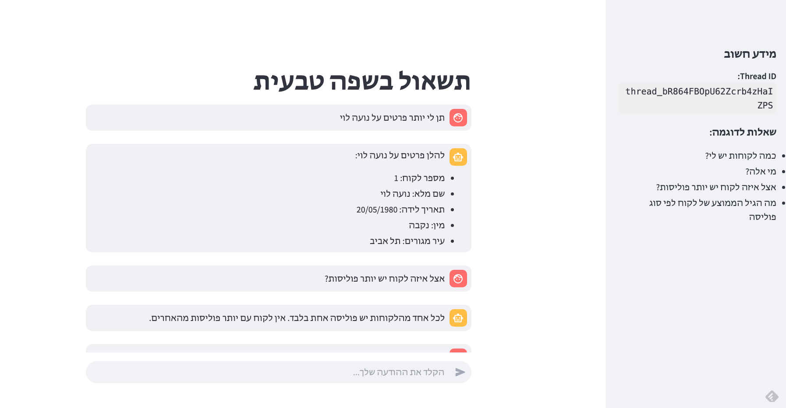

# Multilingual Data Agent

This project demonstrates how to build a text-to-SQL agent capable of querying Microsoft Fabric Lakehouse and summarizing the results in natural language. It serves as a solution accelerator for scenarios where the schema or data is in a non-English language—until official support for multilingual capabilities becomes available in Fabric Data Agent.



## Scenario

This demo simulates an AI assistant designed to help customer support agents, success teams, and call center representatives in an insurance company.

### Agent Capabilities

- Understand user questions in **Hebrew** and respond accordingly.
- Interpret transaction details, insurance policies, payment statuses, and claim history.
- Automatically translate questions into **SQL queries** using the provided schema and run them against the Fabric Lakehouse.
- Use a query tool (`FabricLakehousePlugin`) to fetch results.
- Avoid asking users for additional info — rely instead on schema and predefined examples.


## Table of Contents

- [Multilingual Data Agent](#multilingual-data-agent)
  - [Scenario](#scenario)
    - [Agent Capabilities](#agent-capabilities)
  - [Table of Contents](#table-of-contents)
  - [Features](#features)
  - [Prerequisites](#prerequisites)
  - [Usage](#usage)
  - [Contributing](#contributing)

## Features

- 🧠 Uses **Azure AI Agent Service** to create and run agents in a simple, managed way
- 🧩 Extends Azure AI Agent using **Semantic Kernel** for tool calling and Fabric integration
- 💬 Includes a **Streamlit**-based sample chat UI for interacting with the agent

## Prerequisites

Before running the solution, complete the following setup steps:

1. **Load Data into Fabric Lakehouse**  
   Prepare a Lakehouse in Microsoft Fabric and upload the demo data.

2. **Use Sample Datasets**  
   Use the `datasets/` folder provided in this repo. It contains three sample tables:
   - `dim_lakochot`
   - `dim_polisot`
   - `fact_tviot`

3. **Create a New Azure AI Agent**  
   Follow the official guide:  
   [Create and Run Agents in VS Code – Azure AI Agent Service](https://learn.microsoft.com/en-us/azure/ai-foundry/how-to/develop/vs-code-agents)

   Use the provided reference file [`setup/DataAgent.yaml`](setup/DataAgent.yaml) as your starting point. It includes preconfigured tools and instructions aligned with this demo’s scenario and schema.

4. **Clone the Repository**
   ```bash
   git clone https://github.com/moryachok/multilingual-data-agent.git
   cd multilingual-data-agent
    ```
## Prerequisites

Before running the solution, complete the following setup steps:

1. **Load Data into Fabric Lakehouse**  
   Prepare a Lakehouse in Microsoft Fabric and upload the demo data.

2. **Use Sample Datasets**  
   Use the `datasets/` folder provided in this repo. It contains three sample tables:
   - `dim_lakochot`
   - `dim_polisot`
   - `fact_tviot`

3. **Create a New Azure AI Agent**  
   Follow the official guide:  
   [Create and Run Agents in VS Code – Azure AI Agent Service](https://learn.microsoft.com/en-us/azure/ai-foundry/how-to/develop/vs-code-agents)

   Use the provided reference file [`setup/DataAgent.yaml`](setup/DataAgent.yaml) as your starting point. It includes preconfigured tools and instructions aligned with this demo’s scenario and schema.

5. **Install Python dependencies**
   ```bash
   pip install -r requirements.txt
   ```
6. Run the Streamlit UI
  ```bash
   streamlit run app.py
   ```


## Usage

Go to http://localhost:8501/ in your browser.


## Contributing
Pull requests are welcome. For major changes, open an issue first to discuss what you’d like to change.